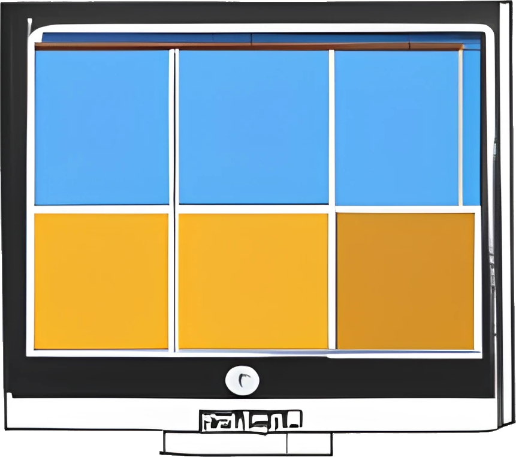

# better-task-view

Better Task View is an open-source JavaScript and AutoHotkey project that aims to provide a faster replacement for the Windows 10 Task View.

Should work on Windows 11 (not tested).

Logo generated with https://www.craiyon.com/

## Features

- Opens almost with no delay
- See all windows from each desktop (live thumbnails). Thumbnails are shrinked to fit all inside the screen
- Activate a window by clicking on its thumbnail
- Close a window with middle-click
- Move a window from one desktop to another with drag-and-drop
- Select multiple windows to move all of them at once
- Rename/Create/Delete desktops
- Switch desktops

## Demo

## Usage

- CapsLock opens the task view. The original Caps Lock function can still be accessed with Ctrl+CapsLock or Shift+CapsLock
- Hover the mouse over a desktop to see its windows
- Left-click a window to switch to it
- Middle-click a window to close it
- Left-click a desktop to switch to its first window
- Drag a window to a desktop to move it
- Hold Ctrl and select multiple windows like a spreadsheet (then move them with drag-and-drop)
- Right-click a desktop for rename/create/delete options
  - New desktops are created at the end
  - Current desktop cannot be deleted. Switch to another desktop first
  - A desktop which has windows cannot be deleted. Close or move the windows first

## Limitations

- No support for multiple monitors (could be extended to support this)
- Cannot switch the order of the desktops. There is no native support for this on Win10, so implementing it would require some workaround
- Cannot create a new desktop "between" other desktops, only at the end. Another Win10 limitation, implementing this would require some workaround

## Issues

If you find a bug or have an idea for a new feature, please open an issue on the github issue tracker. Please include as much information as possible, such as steps to reproduce the issue or a detailed description of the new feature.

## Contributing

Thank you for your interest in contributing to Better Task View! Here are some guidelines to help you get started.

### How to Contribute

- See [docs/architecture.md](docs/architecture.md) for an introduction to the code.
- Fork the Better Task View repository on GitHub.
- Clone your fork to your local machine.
- Create a new branch from the main branch for your changes.
- Make your changes and commit them with clear and concise commit messages.
  - To test changes to your code, run the `watch-web` npm script (which will update the JS bundle typically in less than 100ms on every file save) and use the "AutoHotkey Debugger" VSCode Task to run the AHK code (breakpoints in ahk code work!). We include `.vscode/launch.json` with this task preconfigured (run with F5)
  - To compile into an executable `dist/better-task-view.exe`, run the `build` npm script
- Push your changes to your fork on GitHub.
- Create a pull request (PR) from your fork to the main branch of the Better Task View repository.

### Code Guidelines

Please follow these guidelines when writing code for Better Task View:

- Use formatting and indentation consistent with the rest of the code.
- Use meaningful variable and function names.
- In case what your code is doing is not obvious, write concise comments to explain what it is doing and why it needs to be done.

## License

See [LICENSE](LICENSE)

[The initial version of this file was written by ChatGPT]
