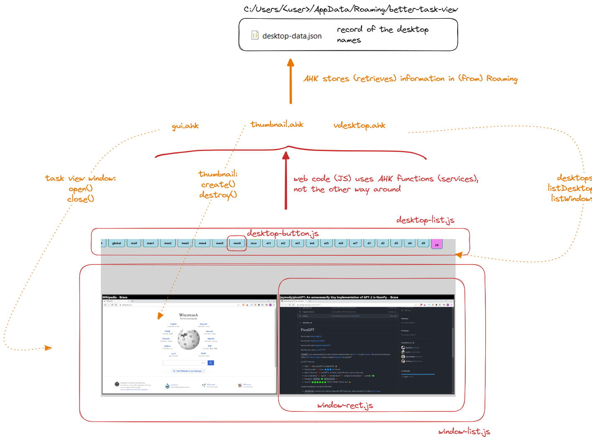

# Architecture

## Overall picture

See diagram image below.

- `index.ahk` runs as a daemon. When user hits CapsLock, the daemon calls `GUI.Open()` to open the app window.
- The app window is just a IE11 browser. It hosts a conventional web app except for the fact that the javascript code has access to a few global variables which are proxies to AHK functions/classes:
	- VDestkop
	- GUI
	- Thumbnail
- When the JS code uses these variables, it actually runs AHK code transparently. This code has access to the underlying system, which means it can call Windows APIs to get desktop and window information, create window thumbnails and access the file system.

## Pitfalls

**Sequential multi-threaded JS**:
- What follows is a working hypothesis, it may be wrong
- JS is usually single-threaded, in the sense that a synchronous block of code cannot be interrupted. 
- However, our web app's JS code is run inside an IE11 browser that is tied to the AHK model of execution, and an AHK thread **can** be interrupted by another AHK thread. 
- The result is that the JS code we run is actually **interruptible**, in the sense that a synchronous block of JS code may be **halted** to run another block of JS code, then later resumed to continue execution.
- This is troublesome at least for thumbnail rendering, because this code is triggered every time the user hovers over a desktop button, and the user may move the mouse among buttons without waiting for rendering to finish. We use locks (see `lock.js`) to handle the interruptions that can occur.

**IE11, ES6 and polyfills**:
- IE11 does not support ES6 and does not have some browser functions such as `element.remove()`
- We use webpack+babel and hand-picked polyfills to write code comfortably in ES6 and transpile it down for IE11

**Lack of knowledge**:
- You will see `FIXME` comments in the code. Some (not all) of them refer to features/fixes that would require deeper knowledge of the Windows API and/or the inner working of AHK threads to figure out a solution.